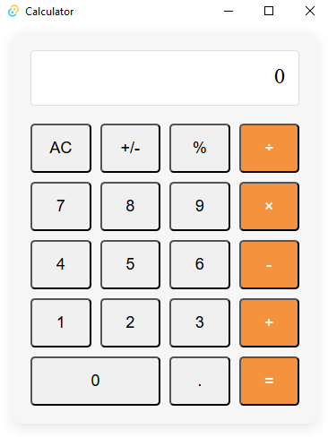

# Calculator
A desktop calculator application built with Tauri, React, and Rust.


## Features:
- Basic arithmetic operations: addition, subtraction, multiplication, division
- Modulo operation (%)
- Error handling for division by zero
- Keyboard support for all operations
- Responsive design with dark mode support
- Cross-platform desktop application
### Screenshots:
</img>

## How to Use
- Use the numeric keypad to enter numbers
- Click on operation buttons or use keyboard keys for operations:
  - `+`: Addition
  - `-`: Subtraction
  - `*`: Multiplication
  - `/`: Division
  - `%`: Modulo
  - `=` or Enter: Calculate result
- Escape: Clear calculator
- Backspace: Delete last digit
- AC button: clears the calculator
- +/- button: toggles between positive and negative values

## Prerequisites
- [Node.js](https://nodejs.org/) (16.0.0 or higher)
- [Rust](https://www.rust-lang.org/tools/install) (stable)
- Platform-specific build tools for Tauri:
  - [Windows Requirements](https://v1.tauri.app/v1/guides/getting-started/prerequisites/#setting-up-windows)
  - [macOS Requirements](https://v1.tauri.app/v1/guides/getting-started/prerequisites/#setting-up-macos)
  - [Linux Requirements](https://v1.tauri.app/v1/guides/getting-started/prerequisites/#setting-up-linux)

## Development Setup
1. Clone the repository:
```
git clone https://github.com/qwertzer12/Calculator-in-Tauri.git/
cd Calculator-in-Tauri
```
2. Install dependencies:
```
npm install
```
3. Start the development server:
```
npm run tauri dev
```
## Building for Production
To create a production build:
```
npm run tauri build
```
The packaged application will be available in the src-tauri/target/release/ directory.

## Technologies Used
[Tauri](https://tauri.app/) - Framework for building desktop applications

[React](https://reactjs.org/) - Frontend UI library

[Rust](https://www.rust-lang.org/) - Backend logic for calculations

[Vite](https://vitejs.dev/) - Frontend build tool
